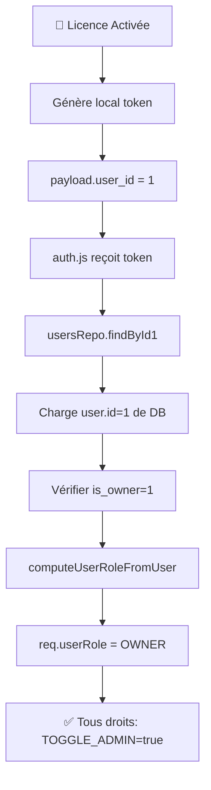

# 🔐 Configuration Complète: Licence + OWNER Role

## 📋 Résumé Exécutif

La **licence** est maintenant liée au rôle **OWNER** dans la base de données. Cela garantit:

| Aspect | Avant | Après |
|--------|-------|-------|
| Licence = Permissions | ❌ Ambigü (LICENSE_ONLY role) | ✅ Clair (OWNER role = licence) |
| Créateur = Droits Admin | ❌ Pas distingué | ✅ is_owner=1 marque le créateur |
| Licence peut promouvoir admin | ❌ Non | ✅ Oui (canToggleAdmin=true) |
| Sécurité escalade privil. | ⚠️ Faible | ✅ Fort (is_owner protégé) |

---

## 🔧 Étapes à Exécuter

### Étape 1: Ajouter la colonne is_owner (Migration)

```sql
ALTER TABLE users ADD COLUMN is_owner INTEGER NOT NULL DEFAULT 0;
CREATE INDEX IF NOT EXISTS idx_users_is_owner ON users(is_owner);
```

**Fichier:** `src/db/migrations/add_is_owner.sql`

**Exécution:**
```bash
# Via SQLite
sqlite3 src/db/gestion_magasin.db < src/db/migrations/add_is_owner.sql

# Ou dans l'app via SQL runner
```

---

### Étape 2: Marquer le Créateur comme OWNER

**Fichier:** `src/db/migrations/mark_creator_as_owner.sql`

```sql
-- Option A: Par ID (le plus courant - créateur = id=1)
UPDATE users SET is_owner=1 WHERE id=1;

-- Option B: Par username
UPDATE users SET is_owner=1 WHERE username='lorie';

-- Option C: Par UUID (si vous avez le UUID du créateur)
UPDATE users SET is_owner=1 WHERE uuid='xxxxx-xxxxx-xxxxx';

-- Vérifier
SELECT id, username, is_owner FROM users WHERE is_owner=1;
```

**Exécution:**
```bash
sqlite3 src/db/gestion_magasin.db < src/db/migrations/mark_creator_as_owner.sql
```

---

### Étape 3: Vérifier que Tout Fonctionne

```bash
# Démarrer l'app
npm start

# Tester avec la licence
# - La licence doit avoir user_id=1 (le créateur)
# - Connecté avec la licence → req.userRole = 'OWNER'
# - Droits: TOGGLE_ADMIN=true, MANAGE_USERS_ALL=true, etc.
```

---

## 🎯 Flux Complet: Licence → OWNER



---

## 📊 Matrice: Licence vs Rôles

### Scénario A: Licence + Créateur (OWNER) ✅

```
Licence active
    ↓
user_id = 1 (créateur)
    ↓
DB: users.id=1, is_owner=1
    ↓
req.userRole = 'OWNER'
    ↓
✅ TOGGLE_ADMIN=true
✅ MANAGE_USERS_ALL=true
✅ Créer comptes
✅ Modifier admin
✅ Promouvoir admin
✅ Tout faire
```

---

### Scénario B: Licence + User Non-Créateur ⚠️

```
Licence active
    ↓
user_id = 2 (un admin)
    ↓
DB: users.id=2, is_admin=1, is_owner=0
    ↓
req.userRole = 'ADMIN'
    ↓
❌ TOGGLE_ADMIN=false
✅ MANAGE_USERS_ALL=true
✅ Créer comptes
✅ Modifier admin
❌ Promouvoir admin ← BLOQUÉ
```

**Conseil:** Changez user_id dans la licence pour pointer vers le créateur (id=1)

---

### Scénario C: Pas de Licence (Hors Ligne)

```
Offline mode
    ↓
Token = 'offline-token'
    ↓
req.user = { id: 0, is_admin: true }
req.userRole = 'ADMIN'
    ↓
❌ TOGGLE_ADMIN=false (offline = ADMIN, pas OWNER)
✅ MANAGE_USERS_ALL=true
```

**Conseil:** Si vous voulez offline = OWNER, modifier auth.js ligne ~55

---

## 🔐 Sécurité: is_owner Protégé

### Protection 1: API ne peut pas modifier is_owner

**users.routes.js PUT /api/users/:id**
```javascript
if ('is_owner' in req.body) {
  return 403;  // Impossible de changer is_owner via API
}
```

**Raison:** Prévient l'escalade de privilèges même avec token compromise

---

### Protection 2: Seulement OWNER peut changer is_admin

```javascript
if ('is_admin' in req.body && !isOwner) {
  return 403;
}
```

**Raison:** Empêche ADMIN de se promouvoir OWNER

---

### Protection 3: is_owner défini seulement en DB

**auth.js**
```javascript
// ⚠️ SÉCURITÉ: admin/owner ne viennent QUE de la DB, jamais du payload
is_admin: false,  // Payload ne peut pas dire "je suis admin"
```

**Raison:** Token non-signé (local.) ne peut pas inventer de droits

---

## 📝 Fichiers Modifiés/Créés

| Fichier | Type | Description |
|---------|------|-------------|
| `src/db/migrations/add_is_owner.sql` | Migration | Ajoute colonne is_owner |
| `src/db/migrations/mark_creator_as_owner.sql` | Migration | Marque créateur OWNER |
| `src/api/middlewares/auth.js` | Code | Reconnaît is_owner, retourne OWNER |
| `src/ui/utils/permissions.js` | Code | OWNER role + TOGGLE_ADMIN permission |
| `src/api/routes/users.routes.js` | Code | Protège is_owner et is_admin |
| `src/ui/pages/UsersPage.jsx` | Code | Désactive buttons si pas permission |

---

## ✅ Checklist d'Implémentation

- [x] `computeUserRoleFromUser()` reconnaît is_owner (auth.js ligne ~16)
- [x] offline-token = ADMIN (auth.js ligne ~55)
- [x] local token + user DB = load is_owner (auth.js ligne ~75)
- [x] OWNER role créé avec TOGGLE_ADMIN=true (permissions.js)
- [x] ADMIN role avec TOGGLE_ADMIN=false (permissions.js)
- [x] Users.routes.js: Protège is_admin change (ligne ~217)
- [x] Users.routes.js: Bloque is_owner change (ligne ~222)
- [x] UsersPage.jsx: Buttons disabled si pas canToggleAdmin (ligne ~1222)
- [ ] **Exécuter migration add_is_owner.sql** ← À FAIRE
- [ ] **Exécuter migration mark_creator_as_owner.sql** ← À FAIRE
- [ ] Tester avec licence: vérifier req.userRole = 'OWNER'
- [ ] Tester: ADMIN ne peut pas promouvoir admin
- [ ] Tester: Peut créer/modifier/promouvoir depuis licence

---

## 🚀 Commandes Prêtes à Copier-Coller

### SQLite (si utilisé localement)

```bash
# Étape 1: Ajouter is_owner
sqlite3 "d:\logiciel\La Grace pro\v1\src\db\gestion_magasin.db" < "d:\logiciel\La Grace pro\v1\src\db\migrations\add_is_owner.sql"

# Étape 2: Marquer créateur
sqlite3 "d:\logiciel\La Grace pro\v1\src\db\gestion_magasin.db" < "d:\logiciel\La Grace pro\v1\src\db\migrations\mark_creator_as_owner.sql"

# Étape 3: Vérifier
sqlite3 "d:\logiciel\La Grace pro\v1\src\db\gestion_magasin.db" "SELECT id, username, is_owner, is_admin FROM users;"
```

### Via l'App (si DB migrator existe)

```javascript
// Dans app startup ou CLI
const migration = fs.readFileSync('src/db/migrations/add_is_owner.sql', 'utf-8');
db.exec(migration);  // Ajoute is_owner

const migration2 = fs.readFileSync('src/db/migrations/mark_creator_as_owner.sql', 'utf-8');
db.exec(migration2);  // Marque créateur
```

---

## 🎓 Comprendre le Flux

**Quand vous activez la licence:**

```
1. Frontend génère: local.{base64({user_id:1, exp:2026-01-15, ...})}
2. Backend reçoit et decode
3. Charge user_id=1 de la DB
4. Vérif: user.is_owner=1? OUI
5. computeUserRoleFromUser() retourne 'OWNER'
6. req.userRole = 'OWNER'
7. Middleware permissions: TOGGLE_ADMIN=true ✅
8. PUT /api/users/:id: Peut changer is_admin ✅
9. Frontend UsersPage: Bouton Admin est cliquable ✅
```

---

## ❓ FAQ

**Q: Et si j'oublie de marquer le créateur OWNER?**
A: Licence = LICENSE_ONLY role → TOGGLE_ADMIN=false → Impossible de promouvoir admin. Réexécutez mark_creator_as_owner.sql.

**Q: Peut-on avoir plusieurs OWNER?**
A: Oui techniquement (is_owner=1 pour plusieurs), mais recommandé d'avoir 1 seul pour éviter conflits.

**Q: Si je change user_id dans la licence?**
A: Pointera vers un autre compte. Ce compte doit avoir is_owner=1 pour avoir TOGGLE_ADMIN=true.

**Q: La licence expire?**
A: Oui, token local a un `exp`. Mais is_owner persiste en DB, donc tant que token valide, droits OK.

**Q: Je peux tester sans migrer?**
A: Non, sans colonne is_owner, l'app va planter (undefined). Faut migrer.

