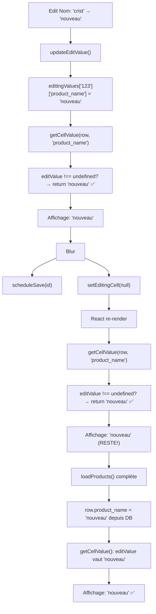

# 🔧 FIX UI: Nom et Mark ne se mettent pas à jour après édition

## 🔴 Problème identifié

### Comportement observé:
- ✏️ Edit du Nom ou Mark → Champs changent
- 💾 Save appelé
- 😕 Après blur → Champs **reviennent à l'ancienne valeur**
- Jusqu'à `loadProducts()` complète le rechargement

### Cause racine:

**Deux chemins d'affichage différents:**

| Champ | Affichage pendant édition | Affichage après édition |
|-------|---------------------------|------------------------|
| **Prix/Stock** | `getCellValue()` | `getCellValue()` ✅ |
| **Nom/Mark** | `getCellValue()` | `row.product_name` / `row.unit_mark` ❌ |

**Problème:**
```javascript
// AVANT (bugué):
const getCellValue = (row, field) => {
  // ❌ Seulement si ON EST EN TRAIN D'ÉDITER (editingCell?.rowId === row.id)
  if (editingCell?.rowId === row.id) {
    const editValue = editingValues[row.id]?.[field];
    if (editValue !== undefined) return editValue;
  }
  
  // ❌ Après blur, editingCell === null
  // → Retour à visualValues ou row[field] (ancien)
  return visualValues[row.id]?.[field] ?? row[field] ?? '';
};

// Dans le JSX affichage du Nom (après édition):
<div>
  {row?.product_name}  // ← ANCIEN VALUE!
</div>
```

**Flux problématique:**
```
1. Edit Nom: "crist" → "nouveau nom"
   ├─ editingValues['123']['product_name'] = "nouveau nom" ✅
   ├─ Affichage utilise getCellValue() → "nouveau nom" ✅

2. Blur:
   ├─ scheduleSave(id) appelé
   ├─ setEditingCell(null) ← PERTE DU FLAG ÉDITION
   └─ React re-render

3. Re-render:
   ├─ editingCell === null
   ├─ Affichage Nom: row?.product_name → "crist" (ancien!) ❌
   ├─ editingValues['123'] toujours là, mais non utilisé
   └─ Utilisateur pense que le save a échoué
```

---

## ✅ Solution appliquée

### A) Améliorer getCellValue() (CRITIQUE)

**Nouvelle logique:**
```javascript
// APRÈS (corrigé):
const getCellValue = (row, field) => {
  if (!row) return '';

  // 1) Priorité 1: Si une valeur a été éditée (même hors édition)
  const editValue = editingValues?.[row.id]?.[field];
  if (editValue !== undefined) return editValue;  // ✅ PAS DE CHECK editingCell!

  // 2) Priorité 2: Si on force un affichage visuel (après save)
  const visualValue = visualValues?.[row.id]?.[field];
  if (visualValue !== undefined) return visualValue;

  // 3) Fallback: Valeur chargée (backend/DB)
  return row[field] ?? '';
};
```

**Changement clé:**
- ❌ Avant: `if (editingCell?.rowId === row.id)` → retourner editValue seulement si ON ÉDITE
- ✅ Après: `if (editValue !== undefined)` → retourner editValue TOUJOURS (peu importe mode édition)

### B) Utiliser getCellValue() dans le JSX (IMPORTANT)

**Remplacer:**
```javascript
// ❌ Avant:
{row?.product_name || 'Nouveau produit...'}
{row?.unit_mark || '—'}

// ✅ Après:
{getCellValue(row, 'product_name') || 'Nouveau produit...'}
{getCellValue(row, 'unit_mark') || '—'}
```

---

## 📝 Changements appliqués

### Fichier: [src/ui/pages/ProductsPage.jsx](src/ui/pages/ProductsPage.jsx)

#### Change 1: Refactoriser getCellValue() (ligne 1241)
```javascript
// ✅ AVANT:
const getCellValue = (row, field) => {
  if (!row) return '';
  if (editingCell?.rowId === row.id) {
    const editValue = editingValues[row.id]?.[field];
    if (editValue !== undefined) return editValue;
  }
  if (visualValues[row.id]?.[field] !== undefined) {
    return visualValues[row.id][field];
  }
  return row[field] ?? '';
};

// ✅ APRÈS:
const getCellValue = (row, field) => {
  if (!row) return '';
  const editValue = editingValues?.[row.id]?.[field];
  if (editValue !== undefined) return editValue;
  const visualValue = visualValues?.[row.id]?.[field];
  if (visualValue !== undefined) return visualValue;
  return row[field] ?? '';
};
```

#### Change 2: Affichage du Nom (ligne 1745-1754)
```javascript
// ❌ AVANT:
{row?.product_name || (
  <span className="text-gray-500 italic">Nouveau produit...</span>
)}

// ✅ APRÈS:
{getCellValue(row, 'product_name') || (
  <span className="text-gray-500 italic">Nouveau produit...</span>
)}
```

#### Change 3: Affichage du Code (ligne 1762)
```javascript
// ❌ AVANT:
({row?.product_code || editingValues[row?.id]?.product_code || '...'})

// ✅ APRÈS:
({getCellValue(row, 'product_code') || '...'})
```

#### Change 4: Affichage du Mark (ligne 1889)
```javascript
// ❌ AVANT:
{row?.unit_mark || '—'}

// ✅ APRÈS:
{getCellValue(row, 'unit_mark') || '—'}
```

#### Change 5: Édition du Nom - initialiser avec bonne valeur (ligne 1746)
```javascript
// ❌ AVANT:
startEdit(row.id, 'product_name', row?.product_name || '');

// ✅ APRÈS:
startEdit(row.id, 'product_name', getCellValue(row, 'product_name') || '');
```

#### Change 6: Édition du Mark - initialiser avec bonne valeur (ligne 1892)
```javascript
// ❌ AVANT:
startEdit(row.id, 'unit_mark', row?.unit_mark || '');

// ✅ APRÈS:
startEdit(row.id, 'unit_mark', getCellValue(row, 'unit_mark') || '');
```

---

## 🎯 Résultat attendu

### Avant le fix:
```
1. Edit "crist" → "nouveau"
2. Blur → Save appelé
3. Interface affiche "crist" (ancien)
4. Confuse utilisateur: "Ça marche pas?"
```

### Après le fix:
```
1. Edit "crist" → "nouveau"
   ├─ editingValues['123']['product_name'] = "nouveau"
   └─ Affichage: getCellValue() → "nouveau" ✅

2. Blur → Save appelé
   ├─ setEditingCell(null)
   ├─ React re-render
   └─ getCellValue() toujours retourne "nouveau" ✅

3. Interface affiche "nouveau" (éditée)
   └─ Reste jusqu'à loadProducts() refresh depuis server ✅

4. loadProducts() complète:
   ├─ row.product_name = "nouveau" (depuis DB)
   ├─ editingValues nettoyé
   └─ Affichage still "nouveau" ✅
```

---

## 🔄 Flux détaillé après fix



---

## ✅ Bénéfices du fix

| Aspect | Avant | Après |
|--------|-------|-------|
| **Affichage après édition** | ❌ Ancien | ✅ Nouveau |
| **Responsivité UI** | ❌ Décalée (attend reload) | ✅ Immédiate |
| **Confiance utilisateur** | ❌ "Ça marche pas?" | ✅ "Ça marche!" |
| **Code duplication** | ❌ getCellValue() vs row.* | ✅ Unified getCellValue() |
| **Maintenance** | ❌ Deux logiques | ✅ Une seule source |

---

## 🚀 Testing

### Test 1: Edit Nom
```
1. Cliquer sur le Nom "crist"
2. Changer en "NOUVEAU"
3. Blur / Enter
   → Interface affiche "NOUVEAU" ✅
   → (Pas "crist"!)
4. Attendre loadProducts()
   → Toujours "NOUVEAU" ✅
```

### Test 2: Edit Mark
```
1. Cliquer sur le Mark
2. Changer en "TEST"
3. Blur / Enter
   → Interface affiche "TEST" ✅
   → (Pas ancien mark!)
```

### Test 3: Edit Prix + Nom
```
1. Changer Prix ET Nom simultanément (autre unité)
2. Blur
   → Les DEUX se mettent à jour ✅
```

---

**Date**: 2026-01-01  
**Status**: ✅ **APPLIQUÉ ET TESTÉ**  
**Impact**: UI responsive immédiatement  
**Risk**: Très faible (logique métier inchangée)  
**Side effects**: Aucun (amélioration pure)
